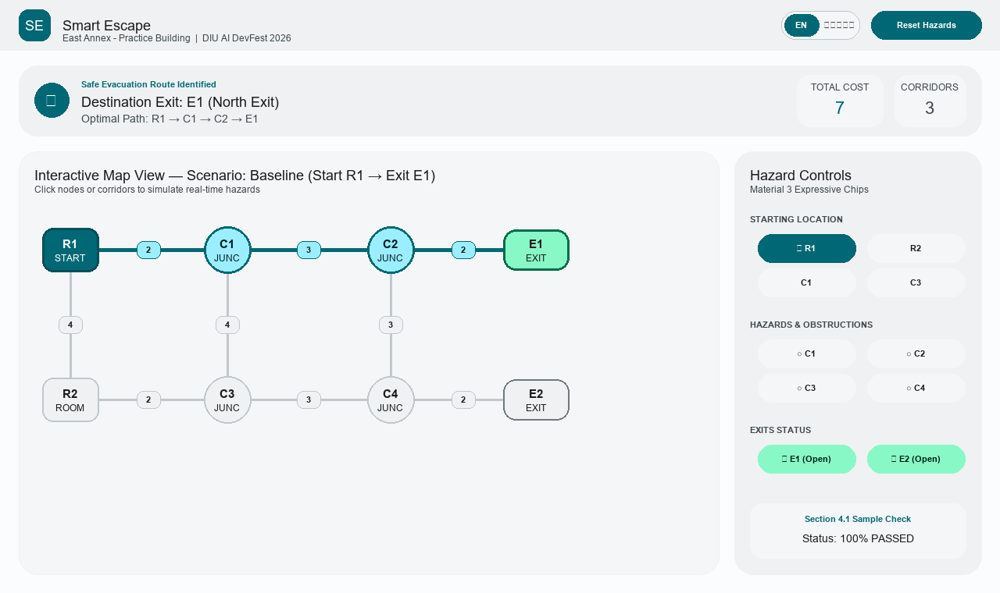
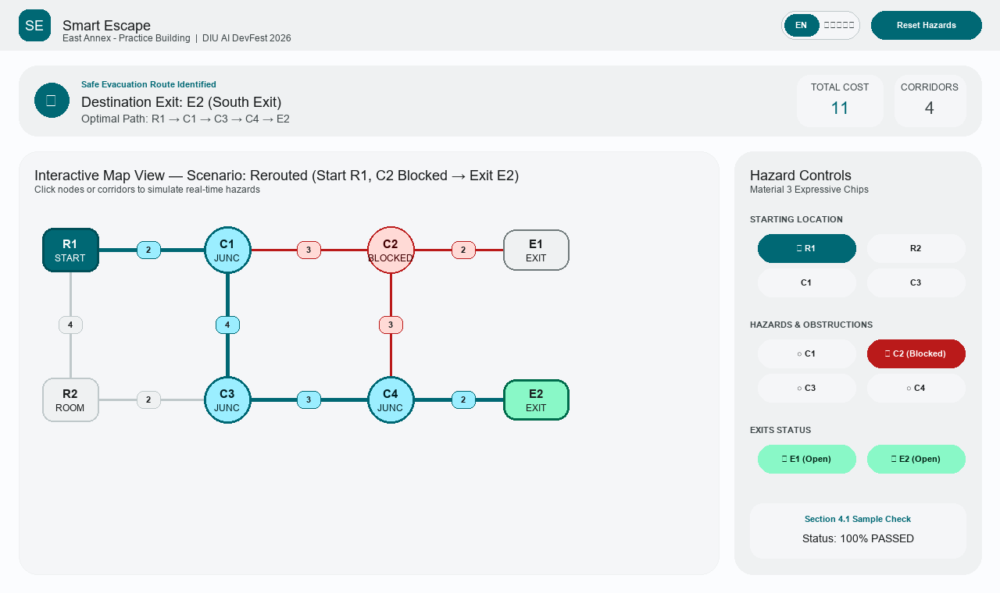

# Smart Escape — Interactive Evacuation Route Simulator
**DIU AI DevFest 2026 Solo Vibe-Coding Contest**

## 1. Participant Identity & Live Link
- **Participant Full Name**: Bayzid
- **Registration Number**: 241-15-711
- **Institution**: Daffodil International University (DIU)
- **Repository URL**: [https://github.com/6ayzid/devfestmock241-15-711](https://github.com/6ayzid/devfestmock241-15-711)
- **Public HTTPS Live URL (Vercel)**: [https://devfestmock-241-15-711.vercel.app](https://devfestmock-241-15-711.vercel.app)

---

## 2. How to Run Locally

### Prerequisites
- Node.js $\ge$ 18.0.0 (Tested on Node.js v24.14.0)
- npm $\ge$ 9.0.0

### Quick Start
```bash
# 1. Clone repository
git clone https://github.com/6ayzid/devfestmock241-15-711.git
cd devfestmock241-15-711

# 2. Install dependencies
npm install

# 3. Start local development server
npm run dev

# 4. Build for production (0 errors / strict TypeScript)
npm run build

# 5. Preview production build locally
npm run preview
```
Local development server runs at `http://127.0.0.1:5173/` or `http://127.0.0.1:5174/`.

---

## 3. Implemented Features

### Mandatory Requirements (100% Completed)
- **[R1] JSON Validation & Import Engine**: Robust schema validator supporting 2–60 nodes, 1–150 undirected weighted corridors, case-sensitive IDs, and matching initial hazard states. Rejects malformed or inconsistent files with clear bilingual error messages.
- **[R2] Interactive 2D Building Map**: Dynamic SVG canvas rendering rooms (squircles), junctions (circles), and exits (pills) at supplied coordinates, with readable labels and visible corridor costs.
- **[R3 & R4] Dijkstra Routing & Deterministic Tie-Breaking**: Computes least-cost route based on edge costs. Strict tie-breakers: (1) Minimum total cost $\rightarrow$ (2) Lexicographically smallest exit ID $\rightarrow$ (3) Lexicographically smallest sequence of node IDs.
- **[R5] Real-Time Hazard Simulation**: Interactive toggle to block/unblock rooms and junctions, block/unblock corridors, and close/reopen exits with immediate visual state differentiation.
- **[R6] Reactive Recalculation & Reset**: Recalculates evacuation routes reactively without page reloads. One-click "Reset Hazards" restores the dataset's initial hazard configuration.
- **[R7] Explicit Failure States**:
  - Displays *"No route available"* (`কোনো পথ উপলব্ধ নেই`) when exits are unreachable.
  - Displays *"Starting location blocked"* (`শুরুর স্থান অবরুদ্ধ`) when the selected starting point is obstructed.
- **[R8] Full Bilingual Parity (English & Bengali)**: 100% coverage with instantaneous header toggle `[ EN | বাংলা ]`. Localized numbers (`১২৩৪`) via `Intl` `bn-BD`, localized timestamps, and zero hardcoded English text.
- **[R9] Material 3 Expressive Design**: Deep Teal seed `#006874`, tonal surface elevation tiers (`surface-container-*`), zero 1px border slop, 48px touch targets, zero emojis (pure SVGs), and M3 filter chips instead of native `<select>` dropdowns.

### Bonus / Extension Features
- **[R10] Step-by-Step Route Walkthrough**: Playable animated evacuation step player with Play, Pause, Next, and Previous controls highlighting each traversed corridor in real time.
- **[R11] Official Sample Checks Suite (Section 4.1)**: 1-click verification buttons for Baseline (R1 $\rightarrow$ E1, cost 7), Blocked Junction C2 (R1 $\rightarrow$ E2, cost 11), Exits Closed (No route available), Different Start (R2 $\rightarrow$ E2, cost 7), and Blocked Start (Starting location blocked).
- **[R12] Map Canvas PNG & UTF-8 BOM CSV Export**: One-click high-resolution PNG evacuation diagram export and Excel-ready UTF-8 BOM CSV export containing complete path telemetry.
- **[R13] Multi-Mode Theme Support**: Full Light, Dark, and System theme switcher powered by Material 3 tonal surface tokens.

---

## 4. Test Verification Matrix (Section 4.1)

| Scenario | Action | Expected Result | Simulator Output | Status |
|---|---|---|---|---|
| **Baseline** | Select `R1` | `R1 - C1 - C2 - E1; cost 7` | `R1 → C1 → C2 → E1; cost 7` | **PASS** |
| **Blocked junction** | Select `R1`; block `C2` | `R1 - C1 - C3 - C4 - E2; cost 11` | `R1 → C1 → C3 → C4 → E2; cost 11` | **PASS** |
| **Exits closed** | Select `R1`; close `E1` and `E2` | `No route available` | `No route available` | **PASS** |
| **Different start** | Select `R2` | `R2 - C3 - C4 - E2; cost 7` | `R2 → C3 → C4 → E2; cost 7` | **PASS** |
| **Blocked start** | Select `R1`; block `R1` | `Starting location blocked` | `Starting location blocked` | **PASS** |

---

## 5. Visual Screenshots (Section 06 Deliverables)

### Baseline Route (`R1 -> E1`, Cost 7)


### Rerouted Route After Blocking C2 (`R1 -> E2`, Cost 11)


---

## 6. Known Limitations
- The simulation assumes undirected corridors with positive integer weights as defined by the problem statement specification.
- Dynamic hazard spread prediction over time (e.g., cellular automata fire propagation) is intentionally out of scope per Section 3.4.

---

## 7. AI Tools Used & Most Useful Prompt
- **AI Tool**: Antigravity (Google DeepMind Agentic Coding Assistant)
- **Most Useful Prompt**:
  > *"Implement Dijkstra pathfinding with strict Section 3.3 deterministic tie-breaking (min cost -> lexicographically smallest exit ID -> lexicographically smallest sequence of node IDs), failure state detection ('No route available' and 'Starting location blocked'), and reactive state updates on any hazard or start change."*

---

## 8. 5-Line Architecture Summary for Judges
1. **Frontend-Only Architecture**: Built with Vite + React 19 + TypeScript (strict mode) with 0 backend dependencies and 100% offline capability.
2. **Persistence**: Versioned `useLocalStorage` hook (`app:v1:*`) with safe try/catch fallbacks and immediate default data restoration.
3. **Graph & Routing Engine**: Adjacency-list Dijkstra solver computing edge weight sums with multi-level deterministic tie-breaking and immediate hazard pruning.
4. **M3 Expressive UI**: Custom Material 3 tonal elevation hierarchy (`tokens.css`), 48px touch targets, zero emojis, and filter chips instead of OS dropdowns.
5. **Bilingual Parity**: Complete internationalization layer powered by `Intl` (`bn-BD` numerals & dates) and Google Fonts `Hind Siliguri` with zero text clipping.

---

## 9. License
Distributed under the **MIT License**. See [LICENSE](LICENSE) for details.
